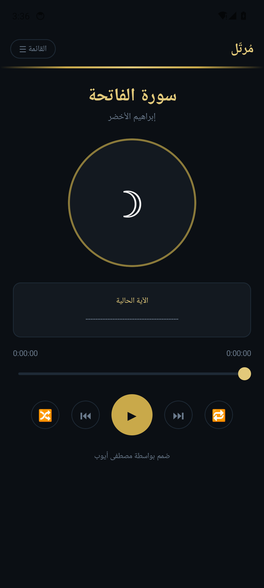

# مُرتّل - Murattel

<p align="center">
  
</p>

تطبيق مجاني لتلاوة القرآن الكريم بأصوات أشهر القراء في العالم الإسلامي.

A free app for listening to the Holy Quran recited by the most renowned reciters.

## ✨ المميزات / Features

- 📖 **114 سورة** كاملة من القرآن الكريم
- 🎙 **42+ قارئ** من أشهر القراء (مشاري العفاسي، السديس، الحصري، وغيرهم)
- 🔊 **متابعة الآيات** أثناء الاستماع — تحديد الآية الحالية تلقائياً
- ▶️ **تشغيل متواصل** — انتقال تلقائي للسورة التالية
- 🔁 **تكرار وعشوائي** — أعد نفس السورة أو استمع لسور متنوعة
- 🔍 **بحث سريع** في السور والقراء
- 🌙 **تصميم ليلي أنيق** مريح للعين
- 🌐 **دعم RTL** — واجهة عربية كاملة

## 📱 المنصات / Platforms

| المنصة | المجلد | اللغة |
|--------|--------|-------|
| **iOS** | `ios/` | Swift + SwiftUI |
| **Android** | `android/` | Kotlin + Jetpack Compose |

## 🛠 البناء / Build

### iOS
```bash
# Install xcodegen if needed
brew install xcodegen

# Generate Xcode project
cd ios
xcodegen generate

# Open in Xcode and build
open Murattel.xcodeproj
```

### Android
```bash
cd android

# Build debug APK
./gradlew assembleDebug

# Build release AAB (for Google Play)
./gradlew bundleRelease
```

## 🔊 مصدر الصوت / Audio Source

التلاوات من [mp3quran.net](https://mp3quran.net) API.

## 📝 الموقع الأصلي / Original Web App

مبني كنسخة من الموقع: [murattel.netlify.app](https://murattel.netlify.app)

## 👨‍💻 المطور / Developer

**صُمم بواسطة مصطفى أيوب**

Designed by Moustafa Ayoub

## 📄 License

MIT License
